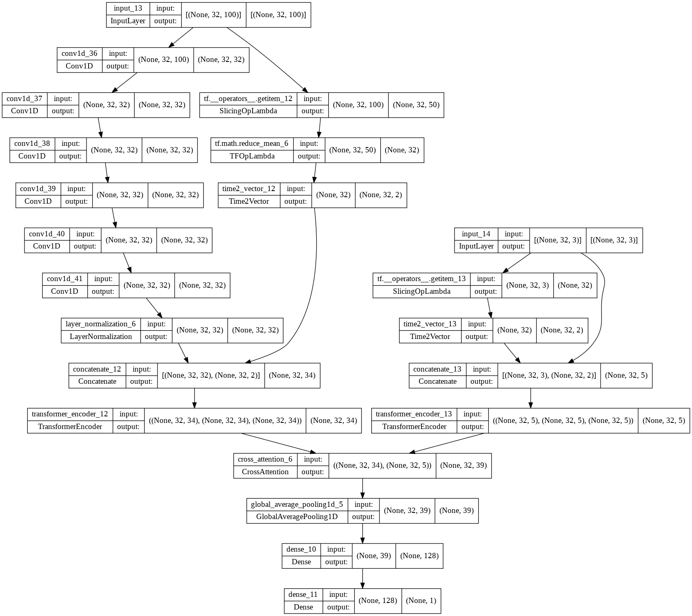

## Результаты кросс-валидации:
Вход:
100 тысяч ордер буков, 5 фолдов кросс-валидации, 1 эпоха на обучение.
| Fold number| train loss | val loss | train accuracy | val accuracy |  
|-----------|------------|---------|-------------|-------------|   
| 1 | 0.7022 | 0.6910  |0.4982 | 0.5355 |   
|2 | 0.7016 | 0.7194  |0.4984 | 0.4626 |   
|3 | 0.7048 | 0.6925  |0.4835 | 0.5289 |    
|4 | 0.6974 | 0.6917 |0.5254 | 0.5275 | 
|5 | 0.6986 | 0.7036  |0.5087 | 0.5118 | 

## Архитектура:

## Dilated causal convolution:

## Cсылки: 
[Stock predictions with state-of-the-art Transformer and Time Embeddings](https://towardsdatascience.com/stock-predictions-with-state-of-the-art-transformer-and-time-embeddings-3a4485237de6)

[Time2Vec: Learning a Vector Representation of Time](https://arxiv.org/abs/1907.05321)

[Transformers for limit order books](https://arxiv.org/abs/2003.00130)
